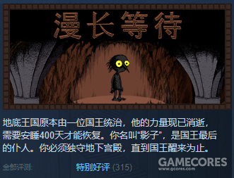
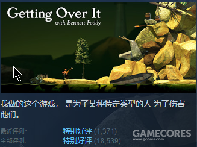

<!-- 
author: MoYuM
created: 2020-03-14
title: 读《何为良好生活》有感：如果没有 GAME OVER
 -->

# 读《何为良好生活》有感：如果没有 GAME OVER

在家重读陈嘉映老师的《何为良好生活》，虽然是本讲伦理学的书，但却让我有了一些新的视角来看待我对于游戏的一些思考：如果游戏没有 GAME OVER 会是什么样？

我想在打游戏的时候最影响正常游玩的，除了讨厌的 BUG 和糟糕的游戏机制外就是 GAME OVER 了。游戏的难度让玩家对一些游戏望而却步，似乎我们因此错过了好些游戏。所以有没有这样一种游戏呢：游玩过程中不会经历失败的游戏。

**用游戏的故事“消除”GAME OVER**

一些游戏把死亡机制融入到游戏背景故事中，比如《黑暗之魂》中的不死人，《死亡搁浅》中的遣返者。这些机制更多是在为了游戏叙事服务，不死人的概念贯穿黑魂始终，遣返者是《死亡搁浅》故事里重要的一环。但对游戏性的帮助则不大，在《死亡搁浅》里死亡时，只要长按方块就能跳过找肉体的过程快速复活，估计小岛也不想玩家浪费太多时间在找自己尸体上。

我能想到的把死亡机制和游戏背景融合最好的是《Braid》，这款游戏里压根就没有 GAME OVER 这一说。当主角触碰怪物“死亡”时，游戏会自动暂停。这时你就得用这游戏的核心机制——时间回溯来救自己一命。一点都不生硬。

但即使这些设定如何精妙，也只是将 GAME OVER 变得不那么直白罢了，并不影响 GAME OVER 的本质。

**当游戏真的不再有 GAME OVER**

Steam 还真有一些不会 GAME OVER 的游戏，例如放置类游戏，最近的比如《漫长等待》（The Longing）。

想要通关这款游戏只需要等待 400 天的现实时间即可。不存在失败、卡关、输掉比赛之类。有的读者可能认为这算不上是一款“游戏”，不过它既然上架了 steam 的独立游戏区，所以咱们暂且将它视作一款游戏。这款游戏的评价是特别好评，这也说明玩家是可以在这样一款游戏中获得乐趣的。

但问题是，我们从这款游戏之中获得的乐趣，和我们在“正常”的游戏中获得的乐趣是一同种乐趣么？

**游戏的乐趣**

我们说一个游戏“好玩”，那差不多就是在说“游玩这款游戏会使我快乐”。但就像陈嘉映老师在《何为良好生活》中说的“一般情况下，好玩、快乐根本不是目的”。好玩、快乐不是游戏的目的，**游戏就是好玩本身**。游戏的乐趣在游戏过程中显现出来。而游戏的通关与游戏胜利的种种奖励，也并非是我们游戏的目的，倒不如说我们为了游戏而设置出种种奖励系统。

我想跟朋友打一盘《街霸》，他不想打，和我说“不打了，算你赢了”，那我当然不会满意。在这里，游戏的过程是主要的。但放置类游戏则走在它的反面，游戏最终的奖励是主要的，过程可以及其简单甚至没有。只有在这类游戏中，我们可以把快乐当成目的去玩一款游戏，这里的目的是外在于游戏的。

同样的例子用在《漫长等待》上，我多半会选择不等那 400 天，直接看结局。

《街霸》中的胜利却不是外在的，而是内置于游戏中，这是游戏乐趣的差别所在。游戏性才是一个游戏“好玩”的关键，我觉得也应该是游戏的关键所在。也正因如此，一些没有精良画面与优秀剧情的游戏也会被我们喜爱。

**游戏的难度提升了游戏的乐趣**

既然我们给游戏设置了胜利，那自然会有失败。失败通常让人不快，输得多了心态都要崩溃。之前大火的抡大锤游戏《Getting Over It with Bennett Foddy》在游戏简介里写明了“我做的这个游戏，是为了某种特定类型的人，为了伤害他们。”

这款游戏明显不是个友好的游戏，玩家虽然不会死亡，但一次次回到起点更使人绝望。失败的痛苦在这个游戏中被放大，但这绝不意味这游戏“不好玩”。相反，这款游戏的评价也是特别好评。

这里的重点在于苦提升了乐的品质，游戏越困难，胜利就越让人快乐。但仅仅在游戏中经历苦难并不会让玩家快乐，战胜苦难才是。这其中包含着努力与向上。面对 BOSS 我们一次次的失败又一次次乐此不疲的挑战，我们不是只在杀死 BOSS 的一瞬才感受游戏的乐趣，那一次次的挑战本身就是乐趣。

而挑战二字本身就带着有点难度的意味。有些玩家以高难度为乐，速通便是其中之一。一个几十分钟速通记录的背后可能是数千小时的付出。那还没打破纪录的数千小时，玩家们乐在其中，以苦为乐。

> 为什么德性、勇敢、力量、豪爽和果断受人尊敬呢？如果没有痛苦挑战，它们又将从何处显出它们的本领呢？

游戏当然不只有挑战才带来快乐，探索，剧情，美术，收集等等都让我们快乐，但作为一款好游戏，我想最要紧的是“好玩”。而失败让这份乐趣变得高级、持久。所以 GAME OVER 的消失了，恐怕不会是个好事。
